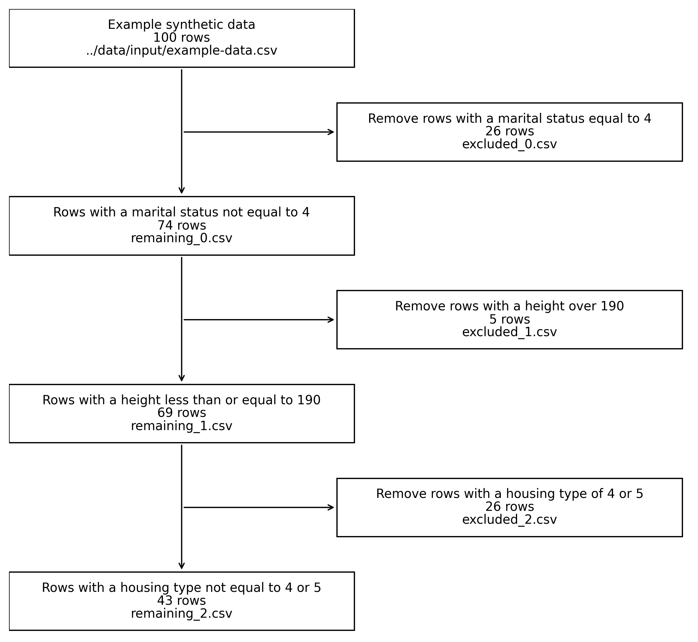
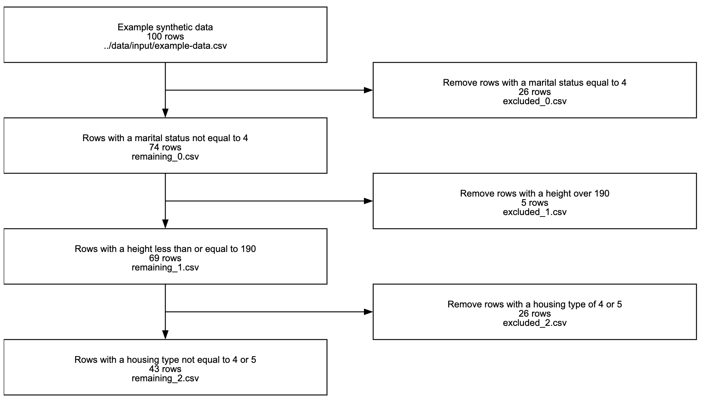

# Exclusion Report

This project contains a Jupyter Notebook that processes a dataset by applying a series of exclusion criteria. The notebook reads input data and exclusion metadata from CSV files, processes the data using the specified exclusion criteria, and generates a visualization of the exclusion process. Additionally, the notebook creates CSV files containing metadata about the exclusion process.

## Example Output

### Visualizations

The Jupyter notebook contains code that produces an image that looks like this:



There is additional code in `./visualization/example-with-d3` that uses the JavaScript library D3.js to produce an image that looks like this:



## Project Structure

The project is organized into the following folder structure:

```
project_root/
│
├── data/
│   ├── input/
│   │   ├── example-data.csv
│   │   └── example-exclusion-metadata.csv
│   └── output/
│       ├── report-data/
│       └── viz-data/
│
├── src/
│   ├── main.py
│   ├── helpers.py
│   └── exclusion_functions.py
│
└── visualizations/
    └── example-viz.png
```

- `data`: Contains all data files for the project, separated into input and output subfolders.
- `src`: Contains the source code files for the project.
- `visualizations`: Contains any generated visualizations created by the script.

## Usage

1. Place your input data and exclusion metadata files in the data/input/ folder.
2. Update the main.py script to use the correct file names for your input data and exclusion metadata.
3. Define your exclusion functions in `./src/exclusion_functions.py`.
4. Run the code in the `main.ipynb` notebook.
5. Update parameters as needed.

## Note about the `example-data.csv`

<<<<<<< HEAD
The `example-data.csv` contains data that was generated using a psuedo-random number generator. It is not real data.
=======
The `example-data.csv` contains data that was generated using a psuedo-random number generator. It is not real data.

> > > > > > > 1bee89fb76abb20df39f7e349b01699968e3eb4f
